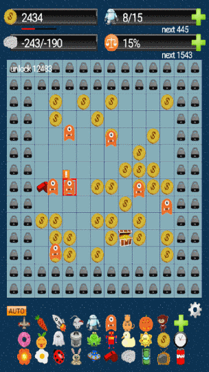

# coineater

Created by Good Game Editor. https://good-ed.blogspot.com  
Play https://smallworld.idv.tw/game/coineater/play.html?pkg=coineater.zip

Coin eater is a game to simulate the evolution of biological mechanisms of nature, let the path finding AI of coin eaters self-evolution.

* Each coin eater is unique with different behavior and intelligence.
* It is funny to observe the interesting behavior of coin eaters.
* From a newbie to evolve into a expert of coin eater.
* There are total 30 different shapes of coin eater for collection.

